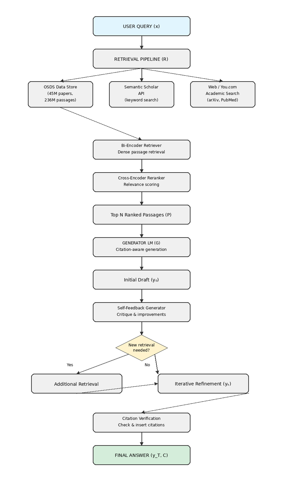

# AI LangGraph Agentic Security Log Monitor

An AI-powered security log monitoring system that ingests server logs via a REST API, displays them in an interactive dashboard, and runs an autonomous LangGraph agent to detect and classify security threats in real time.

The agent makes runtime decisions about which analyzers to run, loops back for deeper analysis when results are inconclusive, branches to specialized sub-workflows for high-confidence detections, and terminates early when logs are benign — all with transparent, step-by-step decision making.


## Slide Deck

[View Presentation](https://app.chroniclehq.com/share/a9743016-68fb-4b6f-b979-491a21bde001/f320e1fa-6e0e-4488-affa-7b05d531cc6c/intro)

## Architecture



### Agent Pipeline

The LangGraph agent uses conditional edges, feedback loops, and specialist branching across 14 nodes:

```
log_ingest -> intent_router -> [conditional: route_analyzers]
    |-- payload_focus  ->  payload_inspector  --|
    |-- sequence_focus ->  sequence_analyzer  --|
    |-- behavior_focus ->  behavior_profiler  --|---> risk_aggregator
    '-- full           ->  run_all_analyzers  --|
                                                         |
                                              [conditional: check_risk_level]
                                              |                        |
                                         risk < 0.25             risk >= 0.25
                                        benign_summary      mini_agent_classifier
                                            -> END     [conditional: route_after_classification]
                                                     |          |          |          |         |
                                                   retry    sqli_deep  cred_deep  idor_deep  default
                                                     |          |          |          |         |
                                                widen_and    specialist nodes      llm_threat_narrative
                                                 _retry -------'----------'----------'         |
                                                (loops back                                   END
                                              to risk_aggregator)
```

**Four agentic behaviors:**

1. **Conditional analyzer selection** — `route_analyzers` skips irrelevant analyzers based on the intent router's analysis mode, so a query like "detect SQL injection" only runs the payload inspector
2. **Early termination** — `check_risk_level` bypasses the classifier and LLM narrative entirely for trivially benign logs (risk < 0.25)
3. **Confidence-based retry loop** — `route_after_classification` widens a focused scan to full analysis when classifier confidence is too low, then loops back through the risk aggregator
4. **Specialist deep-dive branching** — high-confidence classifications route to dedicated analyzers (`deep_sqli_analyzer`, `deep_credential_analyzer`, `deep_idor_analyzer`) that perform targeted pattern matching before generating the final narrative

### Node Reference

| Node                         | Purpose                                                                                                                                      |
| ---------------------------- | -------------------------------------------------------------------------------------------------------------------------------------------- |
| **log_ingest**               | Ingests raw event data into agent state, initializes retry counter                                                                           |
| **intent_router**            | Parses user query (via LLM or keyword fallback) to set analysis mode and dynamic priority weights                                            |
| **sequence_analyzer**        | Detects login velocity, sequential object access, request frequency, repeated actions                                                        |
| **payload_inspector**        | Scans for SQL injection signatures, unexpected fields (isAdmin, role), command injection                                                     |
| **behavior_profiler**        | Evaluates geographic deviation, role deviation, user agent anomalies (e.g. sqlmap)                                                           |
| **run_all_analyzers**        | Runs all three analyzers in a single node (used in "full" analysis mode)                                                                     |
| **risk_aggregator**          | Computes weighted risk score (base: 40% sequence + 40% payload + 20% behavior), fills defaults for skipped analyzers                         |
| **benign_summary**           | Generates a lightweight summary for benign logs, skipping the classifier and LLM                                                             |
| **mini_agent_classifier**    | Evaluates candidate attack hypotheses with supporting/contradicting evidence, selects the strongest match                                    |
| **widen_and_retry**          | Resets mode to "full", re-runs all analyzers, and loops back to the risk aggregator for re-evaluation                                        |
| **deep_sqli_analyzer**       | Checks for encoding evasion, second-order injection patterns, WAF bypass attempts, and catalogs injection points                             |
| **deep_credential_analyzer** | Analyzes failed login counts, source IP distribution, password spray detection, and attack velocity                                          |
| **deep_idor_analyzer**       | Detects sequential ID enumeration patterns across user endpoint access logs                                                                  |
| **llm_threat_narrative**     | Synthesizes all scores and findings into a human-readable threat assessment (LLM-powered with structured fallback)                           |

### Routing Functions

| Function                       | Decision                                                                                         |
| ------------------------------ | ------------------------------------------------------------------------------------------------ |
| **route_analyzers**            | Routes to the appropriate analyzer based on `analysis_mode` (payload_focus, sequence_focus, etc.) |
| **check_risk_level**           | Early-exits to `benign_summary` if risk < 0.25, otherwise proceeds to the classifier             |
| **route_after_classification** | Triggers retry on low-confidence focused scans, specialist deep-dive on high confidence, or goes directly to narrative |

## Project Structure

```
server.py                – FastAPI server exposing GET /logs (serves mock log data)
agent.py                 – LangGraph stateful agent with SecurityState, 14 nodes, conditional edges, and retry loop
main.py                  – Streamlit dashboard: log viewer, agent runner, decision path display, risk visualizations
test_agent.py            – Pytest suite: 69 tests covering helpers, routing, nodes, specialists, and end-to-end flows
test_risk_aggregator.py  – Pytest suite for the risk_aggregator node (weighted scoring, dynamic weights, edge cases)
mock_logs.json           – 16 realistic security log entries across 6 vulnerability categories
requirements.txt         – Python dependencies
.env                     – OpenRouter API key (not committed)
```

## Threat Coverage

The mock dataset and agent detect the following attack patterns:

- **Credential Stuffing** — rapid failed login attempts from the same IP
- **IDOR (Insecure Direct Object Reference)** — user accessing other users' resources via sequential IDs
- **SQL Injection** — `OR 1=1`, `UNION SELECT` payloads, sqlmap user agent
- **Mass Assignment** — injecting `isAdmin` or `role` fields in request bodies
- **Business Logic Abuse** — replaying promo codes or order actions
- **API Scraping** — high-volume data extraction with large limits and bot user agents

## Setup

```bash
python3 -m venv venv
source venv/bin/activate
pip install -r requirements.txt
pip install streamlit openai pandas plotly
```

> **Note:** `streamlit`, `openai`, `pandas`, and `plotly` are required by `main.py` but not yet listed in `requirements.txt`.

Create a `.env` file with your API key (optional — you can also enter it in the UI):

```
OPENROUTER_API_KEY=sk-or-v1-your-key-here
```

## Running

### 1. Start the FastAPI log server

```bash
uvicorn server:app --reload
```

Runs at `http://localhost:8000`.

| Method | Path  | Description                    |
| ------ | ----- | ------------------------------ |
| GET    | /logs | Returns mock security log data |
| GET    | /docs | Interactive Swagger API docs   |

### 2. Launch the Streamlit dashboard

In a separate terminal:

```bash
streamlit run main.py
```

Opens at `http://localhost:8501`.

### 3. Analyze logs

1. Open the Streamlit app in your browser.
2. Enter your **OpenRouter API key** in the sidebar (or load from `.env`). Get one at [openrouter.ai/keys](https://openrouter.ai/keys).
3. Select a **vulnerability type** from the dropdown to view its log entries.
4. Choose a **query preset** or enter a custom query to focus the analysis.
5. Click **Run Agent** to trigger the analysis pipeline.
6. Review the results:
   - **Agent Decision Path** — which analysis mode was used, retry count, and whether a specialist deep-dive ran
   - **Risk score** with color-coded severity indicator
   - **Alert classification** and confidence level
   - **Risk factors** flagged by the agent
   - **Specialist deep-dive findings** (injection points, credential patterns, IDOR enumeration details)
   - **AI threat narrative** — LLM-generated or structured fallback summary
   - **Feature score bar chart** for all individual features
   - **Radar chart** showing max threat score per category (Sequence, Payload, Behavior)
   - **Grouped bar chart** comparing features within each category
   - **Heatmap** of all feature scores across categories
   - **Donut chart** showing weighted risk contribution by category

## Tests

The project includes two test suites:

### Full agent test suite (69 tests)

```bash
pytest test_agent.py -v
```

| Test area                           | What it covers                                                                                           |
| ----------------------------------- | -------------------------------------------------------------------------------------------------------- |
| **Analysis helpers**                | `_analyze_sequences`, `_analyze_payloads`, `_analyze_behavior` — signal detection and edge cases         |
| **Routing functions**               | `route_analyzers`, `check_risk_level`, `route_after_classification` — all conditional branches            |
| **Node behavior**                   | Each node in isolation: log_ingest, intent_router, risk_aggregator, benign_summary, widen_and_retry       |
| **Specialist deep-dive nodes**      | SQL injection, credential stuffing, and IDOR analyzers — detection accuracy and false positive resistance |
| **End-to-end pipeline flows**       | Full graph execution: SQLi detection, credential stuffing, benign early termination, retry loop, IDOR     |
| **Keyword fallback**               | Intent parsing without an LLM client                                                                     |

### Risk aggregator tests

```bash
pytest test_risk_aggregator.py -v
```

| Test class                     | What it covers                                                                                                                                   |
| ------------------------------ | ------------------------------------------------------------------------------------------------------------------------------------------------ |
| **TestDefaultWeights**         | Verifies risk score calculation and risk factor detection with uniform (1.0) priority weights                                                    |
| **TestPayloadBoostedWeights**  | Confirms that a payload priority multiplier of 1.5 (set by intent_router for SQL queries) increases the score relative to baseline               |
| **TestSequenceBoostedWeights** | Confirms that a sequence priority multiplier of 1.5 (set by intent_router for credential/login queries) increases the score relative to baseline |
| **TestBehaviorBoostedWeights** | Confirms that a behavior priority multiplier of 1.5 increases the score relative to baseline                                                     |
| **TestEdgeCases**              | All-zero scores, all-max scores, and boundary testing around the 0.7 risk factor threshold                                                       |

## Key Technologies

- **[FastAPI](https://fastapi.tiangolo.com/)** — REST API for log ingestion
- **[Streamlit](https://streamlit.io/)** — interactive dashboard UI
- **[LangGraph](https://langchain-ai.github.io/langgraph/)** — stateful agent workflow orchestration with conditional edges and cycles
- **[OpenRouter](https://openrouter.ai/)** — LLM gateway (routes to GPT-4o-mini)
- **[OpenAI SDK](https://github.com/openai/openai-python)** — client for OpenRouter API communication
- **[Pandas](https://pandas.pydata.org/)** — log data display and chart data preparation
- **[Plotly](https://plotly.com/python/)** — interactive charts (radar, grouped bar, heatmap, donut)
